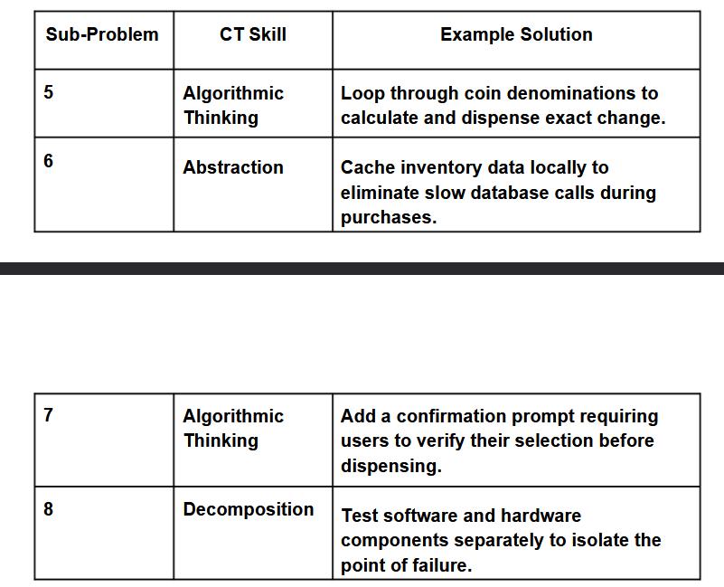
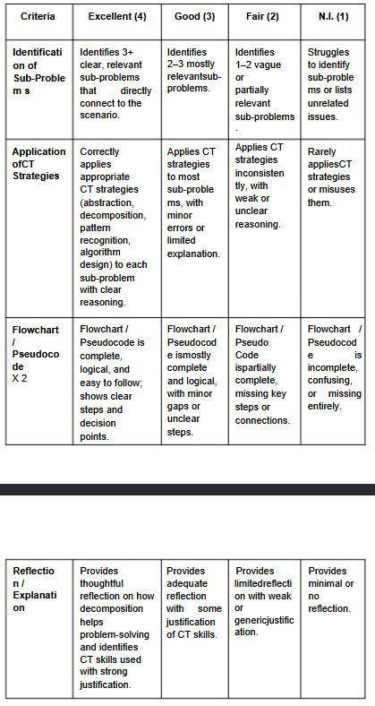
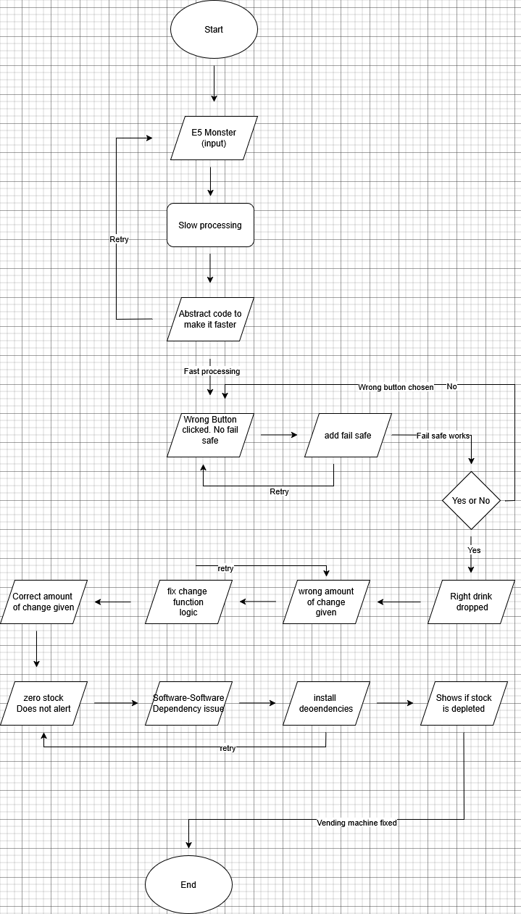

<h1>Annex B</h1>

<h3>Computational Thinking Exercise: "Smart Vending Machine"</h3>

<h5>Section: 9-Potassum              Score:____________ C#</h5>
<h5>Name:Macute,Sigue,Flores         Date: 8/20/2026</h5>

<h4>Scenario</h4>

Your school installs a vending machine to provide snacks and drinks. However,
students encounter several issues:

● Sometimes the machine does not give the correct change. 
● Items run out, but the machine doesn’t notify anyone. 
● Students press the wrong buttons and get the wrong item. 
● The machine is slow when multiple students use it in succession. 

<h5>Your task is to decompose this problem into smaller, manageable parts that
could be solved with computational thinking (CT) Skills.</h5>

<h4>Step 1: Identify the Big Problem</h4>

Main Problem: Vending Machine code written badly.

<h4>Step 2: Identify three to four Sub-Problems</h4>

Please list possible sub-problems:

5. Problem with machine change logic.
 
6. Inefficient code. Causing slowness in the machine.
 
7. No warning/continue with this option? System.
 
8. Incompatibility error with software resulting in hardware compatibility.

<h4>Step 3: Define Computational Thinking Approaches
For each sub-problem, apply CT skills:</h4>

<h4>Step 4: Draw a flowchart or write a pseudocode for the identified</h4>
<h5>sub-problem (Your group could use a separate sheet of paper)</h5>
<h5>Rubrics For Grading</h5>

Total Points: 20pts Criteria & Levels of Performance

Heres a tux for reading to the end. :D

