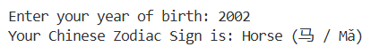

birth_year = int(input("Enter your year of birth: ")) 
 
if birth_year < 1900: 
    print("Invalid Year, it should not be earlier than 1900") 
    exit 
 
zodiac_animals = [  
    "Rat (鼠 / Shǔ)", 
    "Ox (牛 / Niú)",  
    "Tiger (虎 / Hǔ)",  
    "Rabbit (兔 / Tù)",  
    "Dragon (龙 / Lóng)",  
    "Snake (蛇 / Shé)",  
    "Horse (马 / Mǎ)",  
    "Goat (羊 / Yáng)",  
    "Monkey (猴 / Hóu)",  
    "Rooster (鸡 / Jī)",  
    "Dog (狗 / Gǒu)",  
    "Pig (猪 / Zhū)"  
] 
 
zodiac_index = (birth_year - 1900) % 12 
print("Your Chinese Zodiac Sign is:", zodiac_animals[zodiac_index]) 
 

